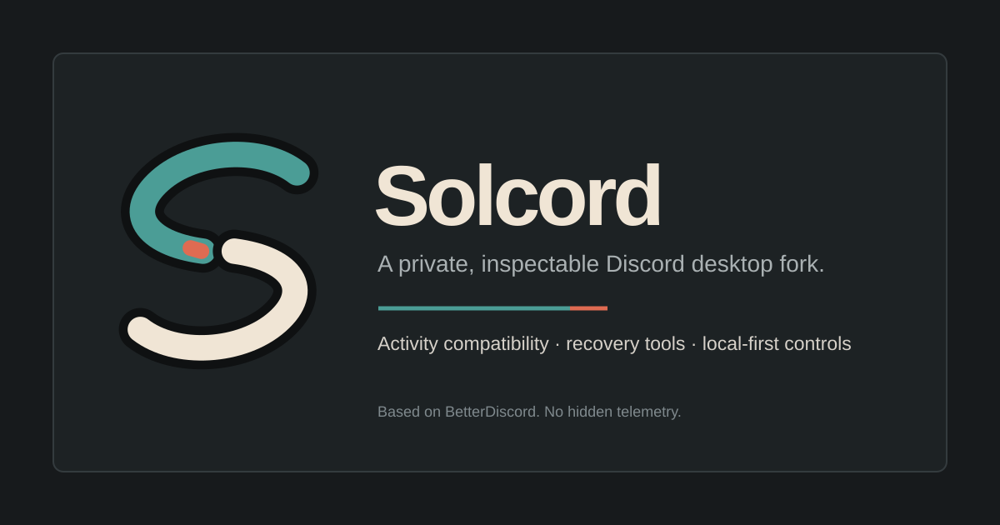

<p align="center">
  
</p>

<h1 align="center">Solcord</h1>

<p align="center"><strong>A Windows-focused BetterDiscord fork built around bounded compatibility, useful local tools, consistent UI, and recovery that can be inspected.</strong></p>

<p align="center">
  <a href="https://github.com/slaveofsolace/Solcord/actions/workflows/solcord-ci.yml"></a>
  <a href="LICENSE"></a>
  <a href="https://github.com/slaveofsolace/Solcord/releases"></a>
</p>

<p align="center"><sub>Fork lineage: <a href="https://github.com/BetterDiscord/BetterDiscord">BetterDiscord/BetterDiscord</a> → <a href="https://github.com/slaveofsolace/Solcord">slaveofsolace/Solcord</a>. Upstream history, contributors, public APIs, addon paths, and Apache-2.0 attribution are preserved.</sub></p>

---

## Current state

Solcord V2 is a release candidate with a self-contained Windows installer, one task-oriented Control Center, a resumable first run, local full-shell themes, recovery tooling, and a bounded compatibility layer for Discord Activities. Lean, Balanced, and Visual profiles control real sampling and motion policy. Optional tools start only after their current Discord adapter validates.

**New user?** Start with the [one-minute Windows guide](docs/QUICK_START.md). It covers download verification, installation, first setup, and rollback without requiring Git or a development toolchain.

> [!IMPORTANT]
> The existing release page contains historical pre-rename artifacts. They are retained for provenance, not presented as the current Solcord build. Use the verified source workflow below until a replacement Solcord-named release is published.

## Why Solcord exists

BetterDiscord supplies the ecosystem and compatibility foundation. Solcord narrows the distribution around four priorities:

| Priority | What it means |
| --- | --- |
| **Performance first** | Optional features are default-off or lazy, shared lookups are cached, and disabled features should own no patches, observers, timers, or listeners. |
| **Bounded compatibility** | Activity Bridge permits only a verified Discord-owned late preload from the same package root; the unrestricted global override stays off. |
| **Useful local tools** | Privacy, composer, call, audio, people, channel, theme, and recovery tools share one settings and lifecycle system. |
| **Honest recovery** | Plugin Doctor, Addon Quarantine, Patch Canary, Settings Time Machine, and receipt-bound rollback expose failure instead of hiding it. |

## Built-in suite

| Area | Included tools |
| --- | --- |
| Compatibility and safety | Activity Bridge, Module Drift Radar, Patch Canary, Plugin Doctor, Addon Quarantine |
| Privacy | Privacy Controls, Link Lens, Invite Inspector, Stream Shield, Screenshot Scrubber, Attachment Guard |
| Messages | Composer Toolkit, Double Click to Reply, guarded splitting, Translation Desk, Channel Glance |
| Calls and audio | Call Context, Audio Console, Voice Note Studio, Voice Health, Shared Call Badge |
| People and spaces | Pin DMs, server hiding/details, local aliases, Focus Channels, encrypted Local Identity Notes |
| Local history and recovery | Message Timeline, Friend Watch, Workspace Profiles, Settings Time Machine, Update Ledger |
| Power Lab | Separately consented, default-off experiments with explicit boundaries |

Every Discord-facing built-in starts through a structural adapter. When an expected Discord module moves, the affected feature should report **Unavailable** without taking down the rest of Solcord.

## Performance baseline

Five clean-room tools share one lazy lifecycle and are off by default:

- Layout Collapse
- Embed Controls
- Cross-platform Autoscroll
- Media Shelf
- Message Link Preview

When all five are off, they perform no Webpack lookup, patching, observation, timer, storage, or network work. Layout Collapse hides only user-selected regions; Embed Controls changes presentation without changing message data; Autoscroll stops on middle-button release or Escape; Message Link Preview reads only an already-loaded message; Media Shelf stores validated local references rather than downloading media. See [the plugin baseline review](docs/audit/PLUGIN_BASELINE_REVIEW.md) and [capability roadmap](docs/roadmap/BASELINE_CAPABILITIES.md).

## Interface system

The Control Center is organized around Overview, Appearance, Performance, Privacy & Safety, Chat & Composer, Voice & Activities, Friends & Spaces, Extensions, Recovery, and Advanced. Its search narrows those workspaces without hiding the active page. Module status uses explicit states such as off, ready, degraded, unavailable, and quarantined.

Solcord uses one semantic token layer for surfaces, borders, text, status, focus, spacing, radius, density, and motion. The interface supports narrow containers, visible keyboard focus, reduced motion, and high Windows scaling without introducing a second component library.

The repository includes local, dependency-free themes. No remote fonts, images, or CSS imports are required. Only one Solcord base theme is active at a time, and selector drift should fall back to ordinary Discord styling rather than leave a partially themed client.

## Audience Guard boundary

Audience Guard can prevent Go Live from starting or stop a stream when a denied person is detected in the current call. Detection after a stream begins cannot guarantee that no frame was briefly exposed.

Discord does not expose individual viewer encryption for ordinary Go Live streams. Server-enforced channel permissions remain the authoritative access boundary. Read [the full boundary](docs/STREAM_AUDIENCE_GUARD.md).

## Build and verify

Solcord uses Bun `1.4.0`. The Windows installer candidate also requires the .NET 8 SDK.

```sh
bun install --frozen-lockfile
bun run audit:repo
bun run verify
bun run dist
```

Useful individual gates:

```sh
bun run test
bun run lint
bun run lint-css:solcord
bun run typecheck
bun run generate-types
bun run circulars
bun run audit:repo:check
```

The production build writes `dist/solcord.asar`. Installation still targets the preserved `betterdiscord.asar` location required by the existing injector contract.

## Repository map

- [`AGENTS.md`](AGENTS.md) — maintainer and Codex rules
- [`docs/QUICK_START.md`](docs/QUICK_START.md) — installation and first setup
- [`docs/SECURITY_AND_PRIVACY.md`](docs/SECURITY_AND_PRIVACY.md) — local-data and network boundaries
- [`docs/ACTIVITY_COMPATIBILITY.md`](docs/ACTIVITY_COMPATIBILITY.md) — Activities architecture
- [`docs/audit/FULL_REPOSITORY_AUDIT.md`](docs/audit/FULL_REPOSITORY_AUDIT.md) — repeatable tracked-line audit
- [`docs/audit/PLUGIN_BASELINE_REVIEW.md`](docs/audit/PLUGIN_BASELINE_REVIEW.md) — plugin-store decisions
- [`docs/handoff/CODEX_HANDOFF.md`](docs/handoff/CODEX_HANDOFF.md) — exact remaining engineering work
- [`CONTRIBUTING.md`](CONTRIBUTING.md) — development workflow
- [`SECURITY.md`](SECURITY.md) — security reports

## Honest limits

Solcord does not extract tokens, backfill unseen messages, access hidden channels, automate user accounts, forge premium state, or silently record/upload media. Translation has no provider enabled by default. Message Timeline retains only explicitly enabled local observations. Experimental tools remain off until separately armed.

A green source build does not prove every current Discord desktop interaction. Live Activities, injection, UI, accessibility, installer, and rollback acceptance must be rerun against the Discord version actually installed on the target machine.

## Fork and attribution

Solcord is forked from [BetterDiscord/BetterDiscord](https://github.com/BetterDiscord/BetterDiscord), originally from its `development` branch. BetterDiscord's history, contributors, license, public APIs, addon paths, and compatibility identifiers remain intact. Solcord's identity, installer, themes, safety layers, compatibility work, and native suite are fork additions.

BetterDiscord and Discord names are used for factual compatibility and attribution. Solcord is not endorsed by Discord. See [LICENSE](LICENSE), [NOTICE](NOTICE), and the [provenance registry](docs/PROVENANCE_REGISTRY.md).
